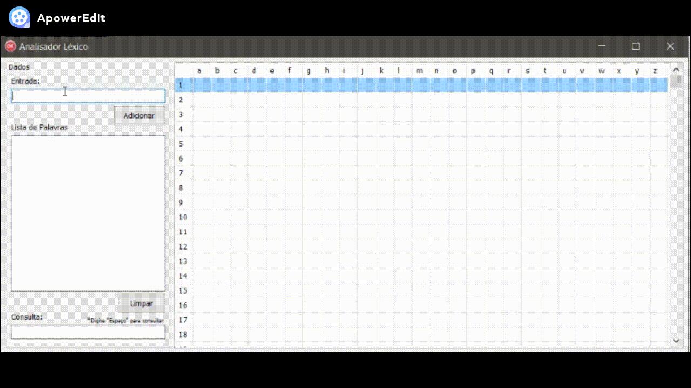
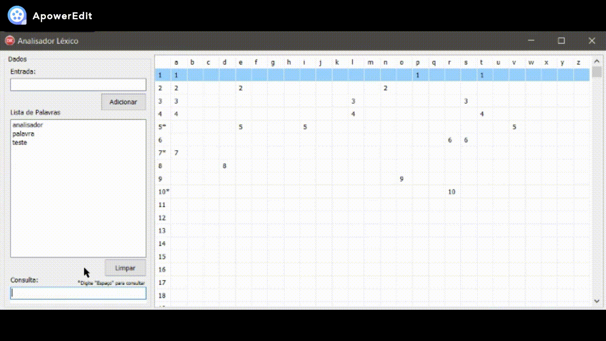

# Analisador Lexico
> Analisador Léxico feito na linguagem Delphi

A construção do Analisador Léxico foi realizadada para um trabalho referente a disciplina de Linguagens Formais, com o objetivo de apresentar uma
aplicação prática dos Autômatos Finitos, mecanismos reconhecedores de Linguagens Regulares.

## Funcionamento

1. O analisador lê a entrada de caracteres, um de cada vez, incluindo no estado em que os caracteres se encontram;
2. Para consulta, o analisador verifica a posição do caractere digitado e localiza o estado em que se encontra;
3. Ao clicar a tecla "espaço", dentro do campo "Consulta" o analisador irá verificar se a palavra informada existe ou não.

## Instalação

Dentro da pasta "Win32/Debug" está localizado o arquivo executável do programa.

## Autor

**Bruno Beltrame** - [*bbeltrame01*](https://github.com/bbeltrame01)